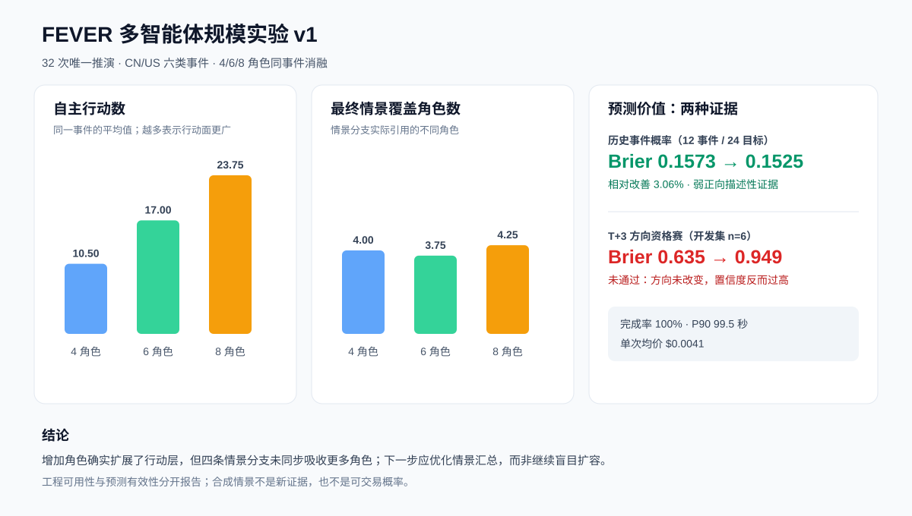
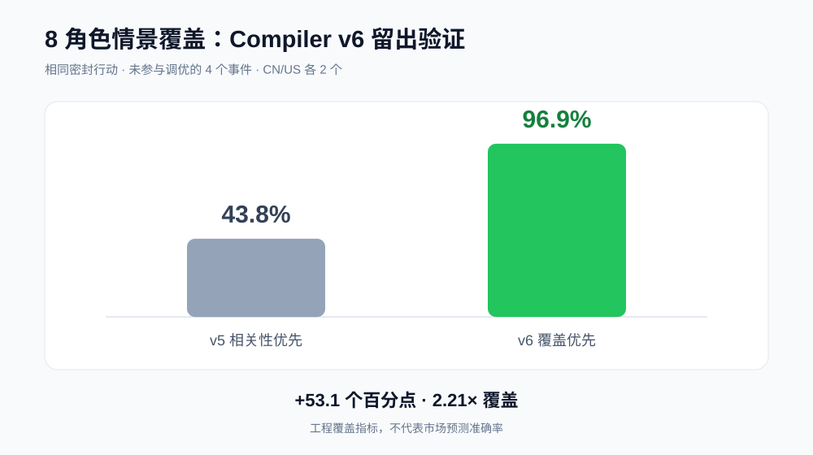
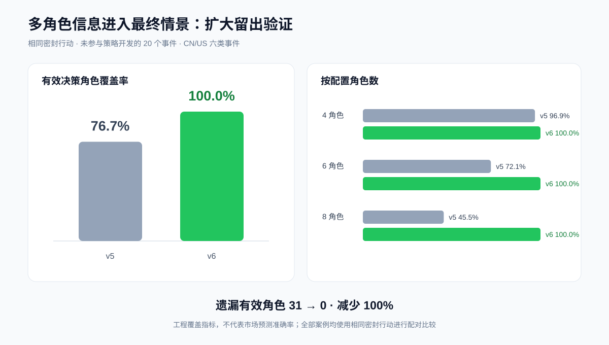

# MiroFish 多智能体规模实验 v1

这是一份可复算的探索性实验包，用于回答两个不同问题：

1. 事件预测员能否稳定运行 4、6、8 个金融参与方，增加角色后是否真的产生更多行动；
2. 合成情景是否改善有真实事后标签的预测指标。

两类结果必须分开解释。情景分支是合成假设，不是新证据，也不能直接当成交易概率。



## 冻结设计

- 主样本：CN/US × 6 类事件 × 每格 2 条，共 24 条；4/6/8 角色各 8 条；
- 同事件消融：4 个事件分别运行 4、6、8 个角色；复用 4 个主样本任务后，共 32 次唯一推演；
- 样本选择：固定 SHA-256 排序，选择阶段不读取 CAR 或方向标签；
- 推演路径：`direct`，直接从证据图编译金融角色，不经过 ZEP；
- 方向资格赛：相同模型、相同事件，比较“仅事件文本”和“加入推演”，主指标是 T+3 三分类 Brier；
- 费用由本地调用账本按当次配置单价估算，不是供应商账单。

事件池存在 46.3% 的重复载荷和 64.3% 的占位式预期文本，因此它适合做工程覆盖，
但未被批准作为正式市场方向数据集。详细准入审计见 `dataset-audit.json`。

## 主要数字

| 项目 | 结果 |
|---|---:|
| 唯一推演 | 32 / 32 完成 |
| 主样本中位 / P90 耗时 | 79.5 / 99.5 秒 |
| 实际活跃角色率 | 100% |
| 有效结构化决策率 | 97.0% |
| 推演总估算成本 | $0.1319 |
| 平均单次估算成本 | $0.0041 |

同一事件的配对消融显示，4→8 个角色时平均自主行动从 10.50 增到 23.75，
但四条最终情景平均覆盖角色数只从 4.00 增到 4.25。也就是说，角色扩容已经真正进入
行动层，下一处瓶颈是情景汇总器，而不是角色调度器。

| 配置角色 | 同事件 n | 平均自主行动 | 情景覆盖角色 | 平均耗时 | 平均估算成本* |
|---:|---:|---:|---:|---:|---:|
| 4 | 4 | 10.50 | 4.00 | 96.2 秒 | $0.0027 |
| 6 | 4 | 17.00 | 3.75 | 95.5 秒 | $0.0041 |
| 8 | 4 | 23.75 | 4.25 | 92.8 秒 | $0.0063 |

\* 成本列使用全部 32 次运行按角色档位汇总；耗时列只使用 4 组同事件消融。并发请求、
模型服务波动和小样本会影响耗时，不能据此声称 8 角色更快。

## 情景汇总器 v6 留出改进

针对上面的汇总瓶颈，v6 改为优先让尚未出现的角色进入情景，再按行动相关性排序。
在未参与问题定位的另外 4 个八角色案例上，使用完全相同的密封行动与金融决策重新汇总：

| 指标 | v5 | v6 | 变化 |
|---|---:|---:|---:|
| 配置角色覆盖率 | 43.8% | 96.9% | +53.1 个百分点 |
| 有效决策角色覆盖率 | 45.5% | 100.0% | +54.5 个百分点 |
| 平均情景分支数 | 3.25 | 4.00 | +23.1% |
| 结构完整率 | 100% | 100% | 持平 |

v6 覆盖率达到 v5 的 2.21 倍；4 / 4 个留出案例覆盖全部具有有效决策的角色。新增编译
只调用模型 4 次，估算成本 $0.0025，中位耗时 35.8 秒。一个案例有 1 / 8 个角色的结构化
决策生成失败，因此该例无法把缺失决策的角色强行写进情景，四例配置角色覆盖平均为 96.9%。



这是一项用户可见产物的工程覆盖改进，不代表市场预测准确率。冻结清单、逐例输入输出和
复现说明见 [`scenario_coverage_v1/`](scenario_coverage_v1/)。

随后把留出范围扩大到未参与策略开发的全部 20 个主实验事件，覆盖 CN/US、六类事件以及
4/6/8 三档角色规模。v5 共遗漏 31 / 108 个有效决策角色，v6 遗漏 0 / 108，遗漏减少
100%；20 / 20 个案例覆盖全部有效决策角色，结构完整率保持 100%。其中 16 个是本轮新增
案例，4 个复用前次相同输出；详细清单和逐例输入输出见
[`scenario_coverage_v2/`](scenario_coverage_v2/)。



预测结果是混合的：

- 既有 v7-C 历史事件概率实验中，12 个独立事件、24 个二元目标、36 次推演，
  Brier 从 B1 的 0.157292 降至 B3 的 0.152474，相对改善 3.06%；11 / 12 个事件未变差，
  在推演实际改变概率的 9 个目标中有 8 个 Brier 误差下降。这是探索性诊断，不是
  “88.9% 预测准确率”；
- 本轮 T+3 市场方向开发资格赛只有 6 个可辨别样本，准确率没有变化，Brier 从 0.635
  恶化为 0.949。情景没有改变方向，只让模型更自信，因此资格赛未通过，未继续消耗费用。

当前可以说明“推演稳定扩展了多方行动覆盖”，不能说明“推演已经改善市场方向预测”。

## 不调用模型地复算

从 Pronoia/FEVER 仓库根目录运行：

```bash
python3 backtesting/mirofish_actor_scale_v1/verify_results.py
```

脚本只使用 Python 标准库，将验证文件 SHA-256、冻结清单、32 次任务完整性、核心工程汇总，
并用相邻的 1000 条标签文件重新计算 T+3 Brier。成功时会打印 `verification: PASS`。

## 重新调用模型

完整运行需要兼容 `/v1/simulations` 契约的 FEVER-MiroFish sidecar 和模型密钥。在配套实验
工作区中运行：

```bash
make start
make scale-manifest
make scale-audit
make scale-pilot                 # 只显示计划，不计费
make scale-pilot ALLOW_BILLABLE=1
make scale-run ALLOW_BILLABLE=1
make scale-score
make scale-package
```

任务可断点续跑；已完成且密封的结果会复用。模型输出具有随机性，重新运行应比较冻结指标，
不要求逐字复现。协议、停止规则与解释边界见 [PROTOCOL.md](PROTOCOL.md)。

## 文件说明

- `manifest.json`：24 个主样本、4 组同事件消融和精确网关请求；
- `runs.jsonl` / `runs.csv`：32 次紧凑工程记录；
- `predictions.jsonl`：6 组开发集配对预测及调用用量；
- `dataset-audit.json`：不读取标签的数据质量审计；
- `report.json` / `report.md`：完整机器可读和人类可读汇总；
- `results.svg`：程序生成的结果图；
- `scenario_coverage_v1/`：v6 情景覆盖留出验证及四组脱敏输入/输出；
- `scenario_coverage_v2/`：v6 的 20 案例扩大留出验证及脱敏复现材料；
- `checksums.json` / `verify_results.py`：完整性与复算入口。

原始任务响应、完整提示和本机运行目录没有提交；它们不是复算这些数字所必需的，并可能含
本地路径。紧凑记录仍保留任务 ID、时间、角色数、行动数、情景覆盖和模型用量，足以审计本文结论。
