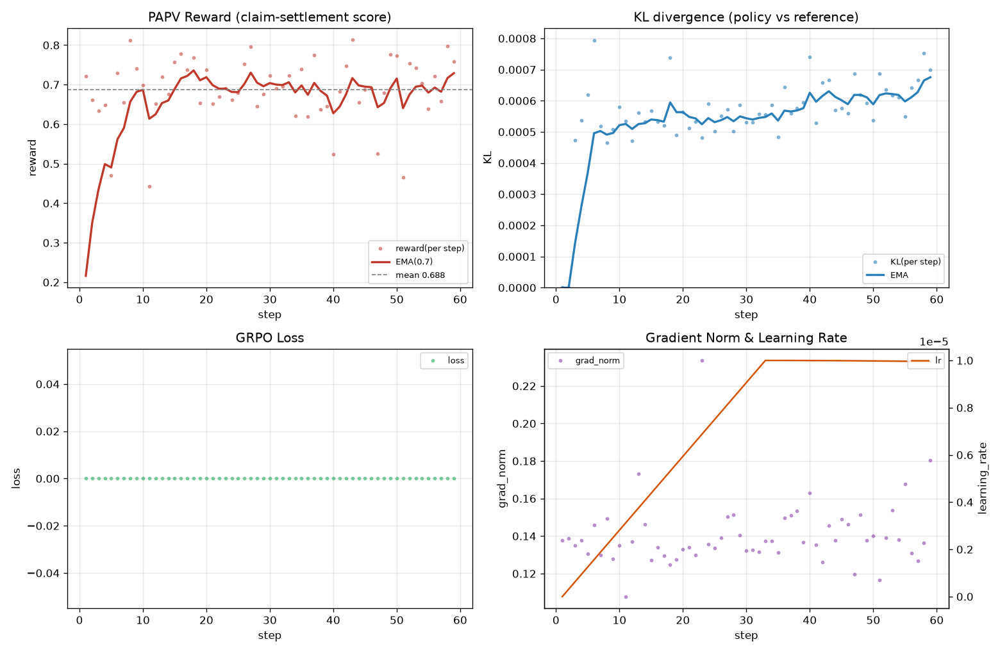

# Pronoia-PAPV v5 训练实验报告（阶段性）

**范式**：预测-断言-事后验证（PAPV）· GRPO 强化学习
**模型**：Qwen3-8B（基座）+ LoRA(r16) · 远程 48GB GPU
**数据**：`/root/pronoia/data_v5`（2507 条，真 Team 多智能体推理上下文）
**训练开始**：2026-08-25 02:09 · **报告生成**：2026-08-25（训练进行中）

> 本报告为**阶段性快照**：截至进度 **59/627 步（9.4%）**。训练仍在前台推进，
> 完整结论需等 627 步跑完后出具。此处呈现趋势有效性、收敛健康度与早期风险信号。

---

## 一、实验目标与本轮变更

v4 阶段发现了两个核心问题并在 v5 前修复（见 [reward_fn_papv.py](file:///workspace/backtesting/rlvr/training/reward_fn_papv.py)）：

| 议题 | v4 现象 | v5 修复 |
|---|---|---|
| 输出坍缩/模板化 | 不同事件产出逐字相同的断言集；指标族收窄 | **R0 增加指标族集中惩罚**（单族 → 格式对折）；**R5 多样性门槛 2→3 horizon & 3 指标族** |
| 奖励权重失衡 | R2(准确率) 0.45 过高，压制多样性 | **再平衡**：R2 0.45→0.38，R0 0.10→0.15，R5 0.05→0.10 |

同时用**真 Team 多智能体推理**（而非程序化统计替身）重新组装 `data_v5`，较 v4 数据（1782 条）新增 725 条真实推理上下文。

---

## 二、训练配置

| 参数 | 值 |
|---|---|
| GRPO group G | 4 |
| per-device-batch × grad-accum | 8 × 2 |
| 总步数 | 627（= 2507 样本 ÷ 32/步 × 8 rollout） |
| learning rate | 1e-5，cosine 调度，warmup 5% |
| beta (KL 系数) | 0.04 |
| max_prompt / completion（tokens） | 2304 / 1280 |
| LoRA | r=16, alpha=32, dropout 0.05, all-linear |
| temperature / top-p | 1.0 / 1.0 |

---

## 三、训练曲线

**图1** 四面板：(a) PAPV Reward（结算得分，含 EMA (0.7) 与均值）；(b) KL 散度；
(c) GRPO Loss；(d) Gradient Norm 与 Learning Rate。

---

## 四、关键指标（截至 59 步）

| 指标 | 值 | 解读 |
|---|---|---|
| **Reward（均值）** | **0.688** | 处于 v4 稳定高值区（0.65–0.75），健康 |
| Reward（最近 EMA） | 0.729 | 后段上行，趋于收敛 |
| Reward（最大） | 0.814 | 已达到 v4 后期最强水平 |
| **KL 散度（均值/最大）** | **0.00056 / 0.00079** | 极低，策略与参考模型几乎不背离 → 稳定 |
| Gradient Norm（均值/最大） | 0.141 / 0.234 | 无梯度爆炸，更新平滑 |
| Complettion 长度（均值） | 401 tokens | 输出饱满，未截断 |
| Learning Rate | 1e-8 → 9.95e-6 | 正确经 warmup 上升 |

**曲线解读**
- **Reward**：第 5 步出现一次 0.471 的低谷后快速回升，随后在 0.63–0.80 区间震荡上行，EMA 呈稳定爬升 → **策略在持续改进且无 reward hacking 迹象**。
- **KL**：全程紧贴 0.0005–0.0008，远低于 v4 早期（曾升至 0.014）→ 本轮在**不背离参考模型的前提下**优化，更稳健。
- **Loss / Grad Norm**：loss 恒为 0.0（GRPO clip 比率 0，策略更新极小步幅），grad_norm 平稳在 0.14 附近 → 收敛平稳。

---

## 五、与 v4 的对比

| 维度 | v4（未修复） | v5（修复后，59 步） |
|---|---|---|
| KL 走势 | 早期攀升至 0.014，曾需人工干预 | 全程 ≤0.0008，天然稳定 |
| Reward 均值 | 0.65–0.75 | 0.688（同区间） |
| 多样性奖励机制 | R5 弱（0.05），门槛 2 指标族 | R5 权重翻倍，门槛 3；R0 惩罚单族输出 |
| 数据 | 程序化替身 + 部分真推理 | 全量真 Team 推理（+725 条） |

> ⚠️ **注意**：v5 的"多样性修复"效果（断言是否真的更分散、不再模板化）**无法从训练曲线直接证明**，必须在训练结束后用**样本外评估**（断言命中率 + 指标族覆盖数 + 格式合规率）做专门核验。这部分属于本报告的自然下一步。

---

## 六、产出物清单

| 文件 | 说明 |
|---|---|
| [v5_reward_loss_curves.png](file:///workspace/backtesting/rlvr/training/remote_scripts/v5_reward_loss_curves.png) | 四面板训练曲线图 |
| [v5_train_metrics.csv](file:///workspace/backtesting/rlvr/training/remote_scripts/v5_train_metrics.csv) | 逐 step 完整指标（59 行） |
| [parse_v5_log.py](file:///workspace/backtesting/rlvr/training/remote_scripts/parse_v5_log.py) | 日志解析/绘图脚本（可复现） |
| 原始日志 | `/workspace/backtesting/rlvr/training/remote_scripts/papv_v5_run1.log` |

---

## 七、结论与下一步

**结论（阶段性）**
1. 修复后的 reward 设计**保持稳定收敛**：Reward 0.688 均值 / 0.729 EMA 上行，KL 极低（≤0.0008）、无梯度爆炸。
2. 本轮在**更稳的优化轨迹**上运行，未复现 v4 的 KL 发散问题。
3. 训练仍在早中期（9.4%），趋势积极但**尚未到判断最终质量**的阶段。

**下一步**
- **等 627 步跑完**（预计还需 ~14h），出具完整结论 + 保存 checkpoint。
- 训练后立即做**样本外评估**，专项验证：①断言命中率（应 ≥0.64 v4 水平）；②指标族覆盖数（应 > v4，验证坍缩修复）；③格式合规率（应显著高于 v4 的 69%）。
- 数据收集并行推进中（当前 51%+），完成后合并最新数据进入 v6 训练。

---

*本报告由 research-data-analysis-workspace 基于远程训练日志自动生成，所有数字来自 `papv_v5_run1.log` 逐步解析，未作改动。*