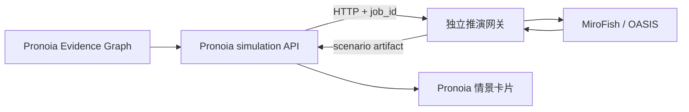

# Pronoia × MiroFish 多智能体事件推演（实验性）

> 状态：Draft / scenario-only。当前功能用于发现和审阅未来情景，不输出校准概率，
> 不构成投资建议。

## 接入目标

Pronoia（仓库名 FEVER）的证据图擅长沉淀“截止当前已经知道什么”；多智能体推演在其后增加一个可选步骤，
让事件主体、机构投资者、监管机构、媒体、上下游等参与方根据同一组有来源的事实采取行动，
再把行动汇总为带触发条件、可能后果和失效条件的情景分支。

推演通常耗时数分钟，因此它不进入普通聊天或 skill 的同步请求，而是通过持久化异步任务运行。



## 本 PR 包含什么

- `simulation_jobs` SQLite 任务表及幂等结果回写；
- 推演创建、状态查询、任务列表、取消和参与方预览 API；
- 刷新后恢复运行任务，终态结果只写入一件 `simulation` 产出物；
- 4/6/8/10 档自动参与方预算，以及手动上限；
- 运行前展示参与方与入选原因；
- 情景分支、触发条件、可能后果、失效条件和执行摘要界面；
- scenario-only 与非投资建议提示；
- 后端接口回归测试和前端生产构建验证。

## 当前仓库边界

本 PR 是 **Pronoia/FEVER 侧客户端与任务编排集成**。它要求一个实现下述契约的独立推演网关运行在
`FEVER_SIMULATION_GATEWAY_URL`。网关参考实现目前位于配套 FEVER-MiroFish 实验工作区，
尚未复制进本仓库；Draft 阶段希望维护者确认最终采用以下哪种交付方式：

1. 将网关作为 FEVER 仓库内的可选独立服务；
2. 将网关发布为单独仓库/版本，并由 FEVER 锁定兼容版本。

保持 HTTP 进程边界也能避免把 MiroFish 的 AGPL-3.0 源码直接并入 FEVER 的 MIT 模块。
最终发布方式和许可证说明应在转为 Ready for Review 前确认。

## 配置与使用

在 `.env` 中配置：

```dotenv
FEVER_SIMULATION_GATEWAY_URL=http://127.0.0.1:5010
FEVER_SIMULATION_GATEWAY_TIMEOUT=15
```

先启动兼容网关，再按原方式启动 FEVER。完成一次深度研究并打开证据图后：

1. 在“多智能体事件推演”中选择“自动推荐”；
2. 免费预览选中的参与方和入选原因；
3. 启动快速推演；
4. 等待后台任务完成，或安全取消；
5. 在右侧产出物中查看情景卡片。

手动选择 4/6/8/10 表示数量上限，不会为了凑数加入证据中没有依据的角色。

## 网关契约

### 运行前预览

`POST /v1/simulations/preview`

只编译证据图和参与方，不调用模型。返回自动预算、实际参与方和每个角色的入选原因。

### 创建任务

`POST /v1/simulations`

请求核心字段：

```json
{
  "case_id": "case_123",
  "source_graph_artifact_id": "artifact_123",
  "evidence_graph": {},
  "as_of": "2026-08-05T10:00:00+08:00",
  "horizon_days": 30,
  "mode": "quick",
  "max_actors": null
}
```

`max_actors=null` 表示自动推荐；整数仅允许 4～10。当前 FEVER API 只开放 `quick`。

### 查询与取消

- `GET /v1/simulations/{job_id}`
- `POST /v1/simulations/{job_id}/cancel`

网关状态至少包含 `status`、`stage`、`progress`、`error`、`finished_at` 和终态 `result`。
FEVER 接受 `completed` 或 `partial` 的结果；`failed`、`cancelled` 只更新任务状态，不创建结果产出物。

## 解释边界

- 证据图中的 source-backed evidence 才能成为模拟事实；claim 和 missing 不得伪装成事实；
- 模拟行动和模型生成的角色判断属于 simulated claims，不会回写为 evidence；
- 单次情景频率和内部一致性不是现实发生概率；
- 当前未开放 calibrated/B3，因为 FEVER predictor 尚未输出逐 target 的结构化 B1；
- 参与方越多不代表结果越好，自动预算用于在利益相关方覆盖、耗时和活跃度之间折中。

## 已验证范围

- FEVER 后端：任务完成幂等回写、取消、自动预算预览；
- FEVER 前端：TypeScript 检查与 Vite 生产构建；
- 配套网关：输入契约、断点状态、协作式取消和角色预算单元测试；
- live quick 冒烟运行：数分钟级完成并生成可展示情景。

正式技术报告和概率能力将使用冻结的事件数据集、多个种子、B1/B3 对照、耗时、成本、
可靠性和失败案例分析另行评估，不属于本 Draft PR 的性能承诺。
